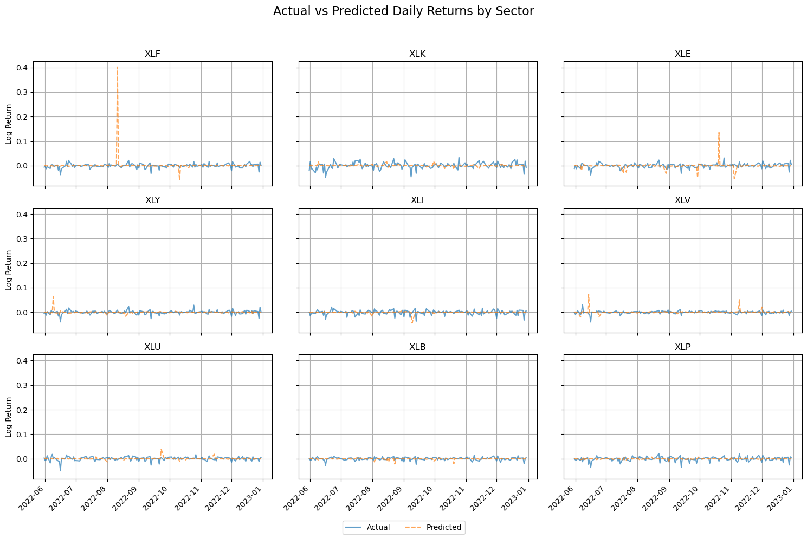

# 📈 Cross-Asset Graph Fourier Neural Operator for Intraday Stock & Factor Prediction

This project implements a **Graph Fourier Neural Operator (GFNO)** for **daily return prediction** across **multiple sectors**, leveraging a custom sector graph and macroeconomic features. The model learns complex cross-sectional dependencies between sectors using **Fourier-based graph convolutions**, applied to **rolling time windows of ETF log returns** and macroeconomic variables.

---

## 📂 Project Structure

```bash
.
├── gfno                    # Training and backtesting
├── gfno_model              # GFNO model
├── pred_vs_actual          # Plotting
└── README.md               # You're here!
```

---

## 📌 Problem Setup

- **Inputs:**
  - Rolling `window` of log returns for 9 sector ETFs
  - Monthly macroeconomic feature matrix `U`
  - Day-of-week one-hot encoding

- **Target:**
  - Next-day log returns of the 9 sectors

- **Model:**  
  A **Graph Fourier Neural Operator (GFNO)** with learned Fourier kernel on a static 9-node sector graph.

---

## 🔧 Key Features

- **Cross-Sector Graph Modeling** via adjacency matrix
- **Graph Fourier Convolution** layers
- **Multi-Horizon Prediction**: Predict all 9 sectors simultaneously
- **TimeSeriesSplit CV** for walk-forward validation
- **Hyperparameter Tuning** with early stopping
- **Backtesting**: Weighted PnL, Sharpe Ratio, and Transaction Costs
- **Visualization**: Actual vs Predicted plots per sector

---

## 🧪 Results Snapshot

| Window | Hidden Dim | LR     | Test MSE   |
|--------|------------|--------|------------|
| 10     | 32         | 0.0005 | 0.000146   |
| 30     | 32         | 0.0010 | 0.000242   |
| 30     | 64         | 0.0005 | 0.000386   |
| 20     | 32         | 0.0010 | 0.001275   |
| 10     | 64         | 0.0005 | 0.004322   |
| 30     | 32         | 0.0005 | 0.007983   |
| 20     | 32         | 0.0005 | 0.028960   |
| 20     | 64         | 0.0005 | 0.104696   |
| 10     | 32         | 0.0010 | 0.182149   |
| 20     | 64         | 0.0010 | 0.639344   |
| 10     | 64         | 0.0010 | 1.845471   |
| 30     | 64         | 0.0010 | 4.174082   |
_Models trained with early stopping and tested on unseen time periods._

---

## 📈 Example Plot

_Comparison of predicted vs actual returns for each sector._



---

## 🧠 Model Architecture

**GFNO Block**  
Input (T, 9) → Positional & Sector Embeddings → Fourier Convolution → FeedForward → Output (T, 9)

- Graph Fourier Basis built using eigenvectors of the sector graph Laplacian
- Multiple GFNO layers with residual connections
- Dropout for regularization

---

## 🚀 How to Run

### 1. Clone & Install
```bash
git clone https://github.com/yourusername/gfno-sector-prediction.git
cd gfno-sector-prediction
pip install -r requirements.txt
```

### 2. Launch Notebook
```bash
jupyter notebook notebook.ipynb
```

---

## 🧪 Reproducibility

To ensure reproducible results:
```python
import numpy as np, torch, random
SEED = 42
np.random.seed(SEED)
random.seed(SEED)
torch.manual_seed(SEED)
torch.cuda.manual_seed_all(SEED)
```

---

## 🧪 Evaluation Metrics

- **Test MSE**
- **Cumulative Return**
- **Sharpe Ratio**
- **Max Drawdown**
- **Transaction Costs** assumed at 5 bps per turnover

---

## ⚠️ Known Limitations

- Uses only 9 S&P sector ETFs — no individual stocks
- Assumes monthly macro factors are known at end-of-month (may introduce lookahead bias if not adjusted)
- No slippage or liquidity modeling
- Doesn’t account for survivorship bias in ETF universe

---

## 📌 Future Work

- Extend to **single-stock universe**
- Try **attention-based Graph Transformers**
- Add **alternative macro alpha features**
- Test on **real-time** data
- Ensemble with simpler models (e.g. linear regressions)

---

## 🧾 References

- Li et al., Fourier Neural Operator for PDE Learning
- Chen et al., Graph Fourier Neural Operator (NeurIPS 2022)
- Sector ETF Data from Yahoo Finance

---

## 👨‍💻 Author

**Nachiket Chondhikar**  
[LinkedIn](https://www.linkedin.com/in/nachiket-chondhikar)

---
# Thanks For Reading Through! Any feedbacks and suggestions are welcome!
